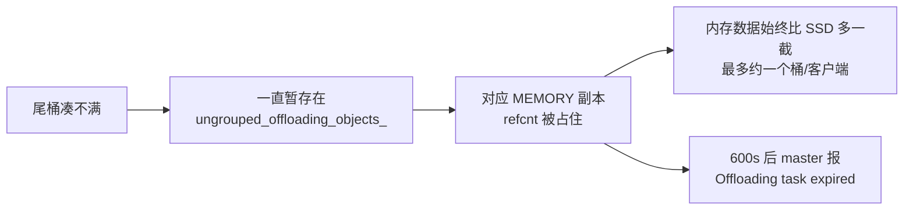
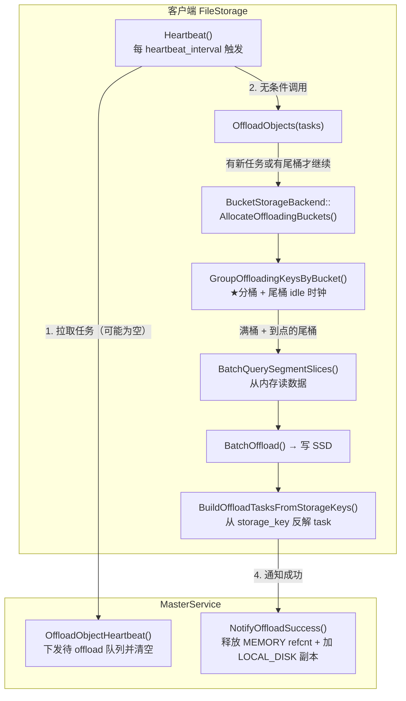
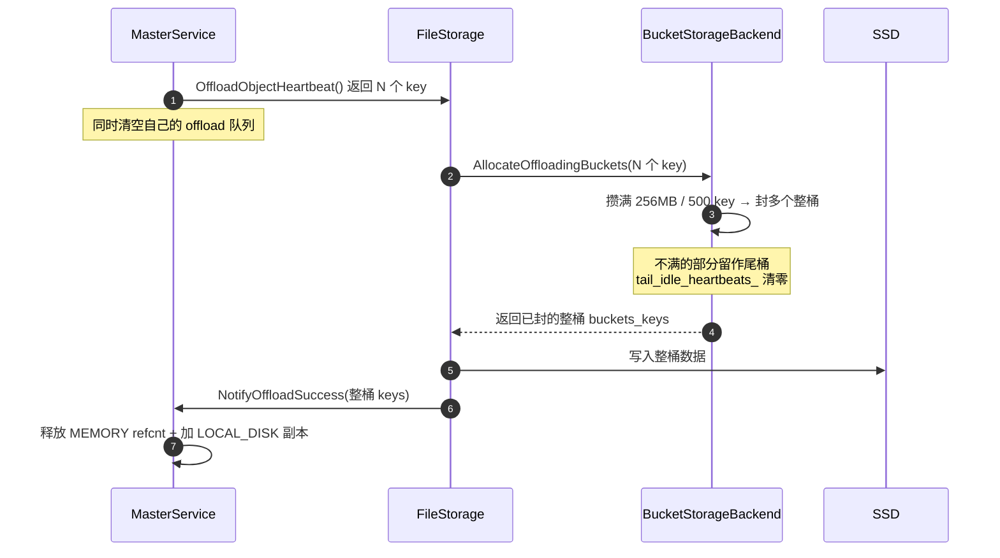
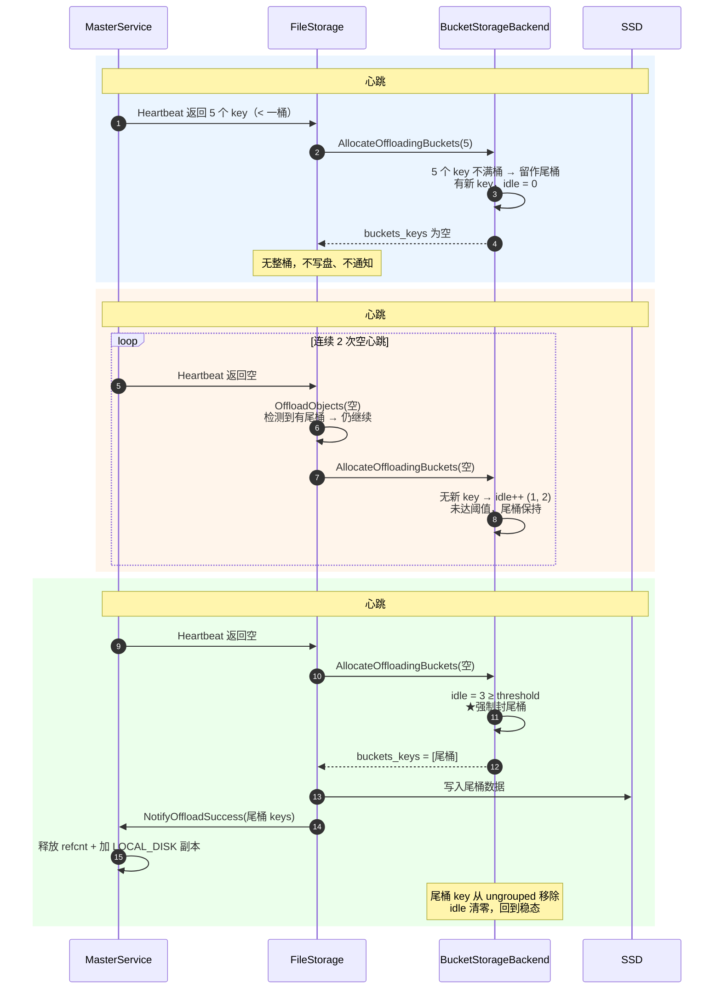
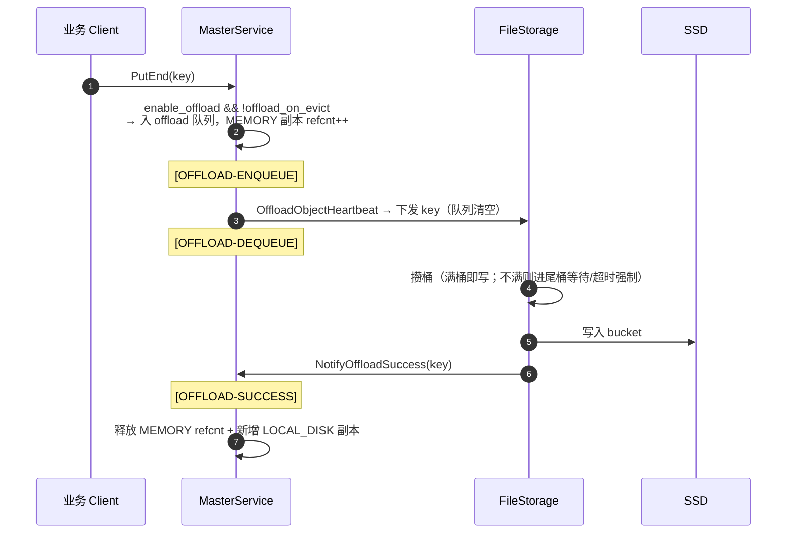
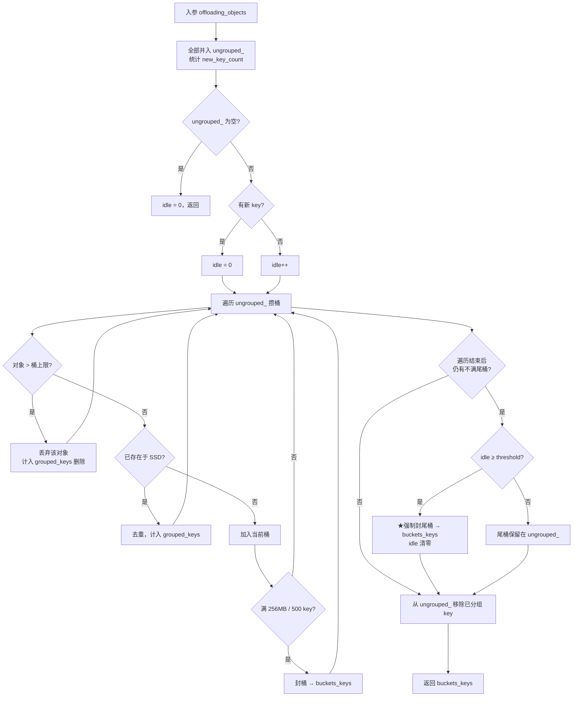
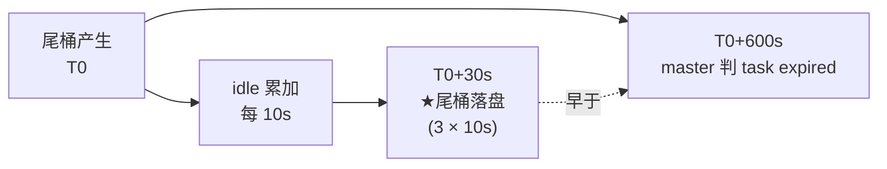

# Offload 尾桶落盘改造（Tail Bucket Flush）

## 1. 背景与问题

Mooncake Store 的 SSD offload 在客户端（`FileStorage` / `BucketStorageBackend`）侧采用**攒批成桶**的方式写盘：master 通过心跳把待 offload 的对象下发给客户端，客户端把多个对象打包进一个 **bucket**（默认上限 256MB 或 500 个 key，先到先封），再整桶写入 SSD。

攒批能显著降低小文件数量和写放大，但带来一个边界问题：

> **当一批对象既凑不满 256MB、也凑不满 500 个 key 时，这个"不满的尾桶"会被暂存在内存里等待后续对象来凑满。一旦写入停止或变慢，这个尾桶就永远封不上、永远不落盘。**

后果链条：



典型现象：

- master 面板上 **memory 的数据量稳定地比 SSD 多一些**（差值最多约"一个未满桶 × 客户端数"）；
- 约 10 分钟（`put_start_release_timeout_sec_` 默认 600s）后，master 周期性打印 `Offloading task expired for key: ...`；
- 这些 key **既不会落盘，也不会重试**（在 `offload_on_evict=false` 模式下，offload 只在 PutEnd 入队一次）。

本次改造的目标：**保证最后一个不满的尾桶最终也能落盘**，消除上述内存/SSD 长期差值和超时告警。

---

## 2. 核心概念

| 概念 | 说明 |
|------|------|
| **bucket（桶）** | SSD 上的一个数据文件，多个对象合并写入。封桶条件：累计大小达 `bucket_size_limit`（默认 256MB）**或** key 数达 `bucket_keys_limit`（默认 500），先到先封。 |
| **ungrouped 尾桶** | 一轮分桶后凑不满整桶的剩余对象，暂存在 `BucketStorageBackend::ungrouped_offloading_objects_`（`storage_key → size`），等待后续心跳凑满。 |
| **idle 心跳计数** | `tail_idle_heartbeats_`：连续多少次分桶调用"没有新 key 进来"。它是尾桶强制落盘的"时钟"。 |
| **强制落盘阈值** | `tail_flush_heartbeat_threshold`（默认 3）：idle 计数达到该值时，强制把不满的尾桶也封桶落盘。 |
| **storage_key** | 租户隔离的存储键，格式 `tenant_id + '\0' + user_key`，可通过 `ParseTenantScopedStorageKey` 反解出 `tenant_id` 与 `user_key`。 |

---

## 3. 配置项

| 配置 / 环境变量 | 默认值 | 作用 |
|------|:--:|------|
| `tail_flush_heartbeat_threshold` / `MOONCAKE_OFFLOAD_BUCKET_TAIL_FLUSH_HEARTBEATS` | 3 | 尾桶在连续多少个"空闲心跳"后强制落盘 |
| `bucket_size_limit` / `MOONCAKE_OFFLOAD_BUCKET_SIZE_LIMIT_BYTES` | 256MB | 单桶大小上限 |
| `bucket_keys_limit` / `MOONCAKE_OFFLOAD_BUCKET_KEYS_LIMIT` | 500 | 单桶 key 数上限 |
| `heartbeat_interval_seconds` / `MOONCAKE_OFFLOAD_HEARTBEAT_INTERVAL_SECONDS` | 10s | 客户端心跳间隔 |
| `put_start_release_timeout_sec`（master 端） | 600s | offload 任务超时阈值（用于对比，未改动） |

**时序安全**：默认 `3 × 10s = 30s` 触发尾桶落盘，远小于 master 的 600s 超时，因此尾桶会在被判 `task expired` 之前完成落盘。若自定义心跳间隔，应保证 `threshold × heartbeat_interval < put_start_release_timeout_sec`。

---

## 4. 整体调用链



要点：

- `Heartbeat()` **无条件**调用 `OffloadObjects()`（即使 master 返回空任务）；
- `OffloadObjects()` 只有在"**既无新任务又无尾桶**"时才快速返回，否则继续进入分桶——这保证了空闲心跳也能推动尾桶的 idle 时钟；
- 写盘成功后，通过 `storage_key` 反解出 `tenant/key` 构造 `OffloadTaskItem`，再调 `NotifyOffloadSuccess()`，因此**跨心跳遗留的尾桶 key 也能正确通知 master**。

---

## 5. 时序图

### 5.1 正常路径：满桶即时落盘



### 5.2 核心路径：尾桶在空闲心跳后落盘

这是本次改造修复的关键场景——写入停止后，最后那个不满的尾桶如何最终落盘。



### 5.3 单个 key 的完整生命周期



---

## 6. 分桶与尾桶 flush 的内部逻辑

`GroupOffloadingKeysByBucket()` 的决策流程：



关键不变量：

- **满桶**（靠大小或 key 数封顶）每轮立即进入 `buckets_keys` 落盘；
- **不满的尾桶**只有在 `idle ≥ threshold` 时才强制落盘，否则继续留在 `ungrouped_` 等待；
- **超大对象**（`size > bucket_size_limit`，永远装不进任何桶）被直接丢弃并移出 `ungrouped_`，避免它每个心跳刷错误日志、并让 `ungrouped_` 永远非空而阻塞 idle 清零；
- 已落盘对象（去重命中）也移出 `ungrouped_`，不重复写。

---

## 7. 关键实现要点

### 7.1 空闲心跳必须能驱动 idle 时钟

idle 计数在 `GroupOffloadingKeysByBucket()` 内部累加，因此该函数必须在"空心跳"时也被调用。为此：

- `Heartbeat()` 取消了"master 返回空任务就提前 return"的快捷路径，**无条件**进入 `OffloadObjects()`；
- `OffloadObjects()` 通过 `UngroupedOffloadingObjectsSize() > 0` 判断是否还有尾桶，只有"既无新任务又无尾桶"时才快速返回。

```cpp
auto bucket_backend =
    std::dynamic_pointer_cast<BucketStorageBackend>(storage_backend_);
const bool has_pending_tail =
    bucket_backend && bucket_backend->UngroupedOffloadingObjectsSize() > 0;
if (offloading_objects.empty() && !has_pending_tail) {
    return {};   // 既无新任务也无尾桶，才快速返回
}
```

> 副作用：`Heartbeat()` 现在每个周期都会运行 `ProcessPromotionTasks()`（此前仅在有 offload 任务时运行），promotion 不再在"无 offload 流量"时被饿着。

### 7.2 尾桶 key 的 task 上下文从 storage_key 反解

尾桶 key 来自**之前的心跳**，而每次心跳临时构造的"当前批 task 表"里没有它。由于 `storage_key` 本身可逆（`tenant_id + '\0' + user_key`），且 master 的 `NotifyOffloadSuccess` 只消费 `tenant_id`/`key`，因此**无需任何跨心跳的 task 表**——落盘成功后直接从 `storage_key` 反解：

```cpp
// 复用与 ScanMeta/ReRegister 相同的 helper，统一 task 构造
auto tasks = BuildOffloadTasksFromStorageKeys(keys, metadatas);
auto result = client_->NotifyOffloadSuccess(tasks, metadatas);
```

分桶后从内存读数据时同理，用 `ParseTenantScopedStorageKey` 反解出 `tenant/user_key`：

```cpp
for (const auto& storage_key : keys) {
    auto [tenant_id, user_key] = ParseTenantScopedStorageKey(storage_key);
    storage_keys_by_tenant[tenant_id].push_back(storage_key);
    user_keys_by_tenant[tenant_id].push_back(std::move(user_key));
}
```

### 7.3 与 master 超时的时序关系



只要 `threshold × heartbeat_interval` 远小于 600s，尾桶就能在超时前落盘。

---

## 8. 配置建议

| 场景 | 建议 |
|------|------|
| 默认 | `threshold=3`、心跳 10s → 尾桶约 30s 落盘，适合绝大多数场景 |
| 希望尾桶更快落盘 | 调小 `MOONCAKE_OFFLOAD_BUCKET_TAIL_FLUSH_HEARTBEATS` 或 `MOONCAKE_OFFLOAD_HEARTBEAT_INTERVAL_SECONDS` |
| 对象很小、希望几乎无残留 | 同时调小 `BUCKET_SIZE_LIMIT_BYTES` / `BUCKET_KEYS_LIMIT`，让桶更快封顶（代价：小文件更多、写放大上升） |
| 单对象可能 > 256MB | 必须调大 `MOONCAKE_OFFLOAD_BUCKET_SIZE_LIMIT_BYTES`，否则超大对象会被跳过且不落盘 |

---

## 9. 关键代码索引

| 位置 | 职责 |
|------|------|
| `mooncake-store/include/storage_backend.h` `BucketBackendConfig::tail_flush_heartbeat_threshold` | 尾桶强制落盘阈值配置 |
| `mooncake-store/include/storage_backend.h` `tail_idle_heartbeats_` | 空闲心跳计数（idle 时钟） |
| `mooncake-store/src/storage_backend.cpp` `GroupOffloadingKeysByBucket()` | 分桶 + 尾桶 idle 累加 + 强制 flush + 超大对象丢弃 |
| `mooncake-store/src/storage_backend.cpp` `UngroupedOffloadingObjectsSize()` / `TailIdleHeartbeats()` | 尾桶状态查询（供 `OffloadObjects` 判断与测试断言） |
| `mooncake-store/src/file_storage.cpp` `Heartbeat()` | 无条件驱动 `OffloadObjects()`，使空心跳也能推进 idle |
| `mooncake-store/src/file_storage.cpp` `OffloadObjects()` | 有尾桶时不提前返回；写盘并通知 master |
| `mooncake-store/src/file_storage.cpp` `BuildOffloadTasksFromStorageKeys()` | 从 `storage_key` 反解构造 `OffloadTaskItem` |
| `mooncake-store/src/master_service.cpp` `NotifyOffloadSuccess()` | 释放 MEMORY refcnt、新增 LOCAL_DISK 副本、累计 SSD 用量 |

---

## 10. 测试覆盖

| 测试 | 验证点 |
|------|------|
| `GroupOffloadingKeysByBucket_flushes_tail_bucket` | idle 达阈值后，不满尾桶被强制封桶 |
| `GroupOffloadingKeysByBucket_drops_oversized_object` | 超大对象被丢弃、不复活，且不阻塞尾桶 idle flush |
| `OffloadObjectsDrivesTailFlushClockOnEmptyHeartbeat` | 空心跳调用 `OffloadObjects()` 时，尾桶 idle 时钟持续累加（钉住调用链修复） |

> 端到端（真 master + 真 client 跑完整 `Heartbeat()` 直到 `NotifyOffloadSuccess`）的验证，建议在集成测试层（如 `verify_ssd_balance.py` 风格：写 < 1 桶 → 停写 → 等若干心跳 → 断言 SSD 与 memory 持平、master 无 `task expired`）补充。
