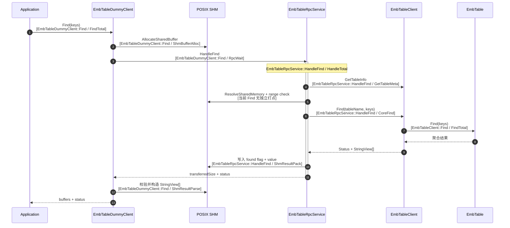
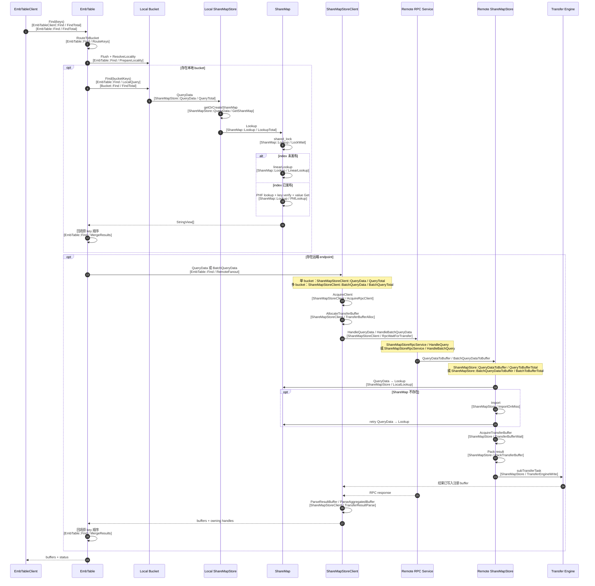

# Mooncake EmbTable Find 调用链与打点说明

## 1. 文档范围

本文基于 Mooncake 当前工作区代码，梳理 EmbTable 批量 `Find` 的调用链、分支时序和 UbDiag `PerfPoint` 位置。

- 分支：`supercache_embtable_dev`
- 基线提交：`b3811715`
- 打点定义：`mooncake-embtable-store/include/embtable_perf_points.def`
- UbDiag program name：`mooncake_embtable`
- 打点表示方式：`Module / Point`
- 统计粒度：批次级；当前没有逐 key 打点，避免干扰 PHF 查询和内存复制
- 工作区状态：`extern/yalantinglibs` 有修改，`extern/ubdiag/` 为未跟踪目录，因此本文描述的是当前工作区，而不是纯净提交

## 2. 总体调用链

EmbTable Find 有两个入口：独立部署模式经 Dummy Client、RPC 和 POSIX SHM 进入核心路径；同进程模式直接进入核心路径。

```mermaid
flowchart TD
    APP["Application"]

    subgraph ENTRY["独立部署入口"]
        DUMMY["EmbTableDummyClient::Find<br/>EmbTableDummyClient::Find / FindTotal"]
        SHMALLOC["AllocateSharedBuffer<br/>EmbTableDummyClient::Find / ShmBufferAlloc"]
        DRPC["等待 EmbTable RPC<br/>EmbTableDummyClient::Find / RpcWait"]
        HANDLE["EmbTableRpcService::HandleFind<br/>EmbTableRpcService::HandleFind / HandleTotal"]
        META["GetTableInfo<br/>EmbTableRpcService::HandleFind / GetTableMeta"]
        RESOLVE["ResolveSharedMemory + range check<br/>当前 Find 无独立打点"]
        COREFIND["调用核心 Find<br/>EmbTableRpcService::HandleFind / CoreFind"]
        SHMPACK["结果复制到 POSIX SHM<br/>EmbTableRpcService::HandleFind / ShmResultPack"]
        SHMPARSE["解析 SHM 结果<br/>EmbTableDummyClient::Find / ShmResultParse"]
        DUMMY --> SHMALLOC --> DRPC --> HANDLE --> META --> RESOLVE --> COREFIND
        COREFIND --> SHMPACK --> SHMPARSE
    end

    subgraph CORE["同进程模式 / 核心 Find"]
        CLIENT["EmbTableClient::Find<br/>EmbTableClient::Find / FindTotal"]
        TABLE["EmbTable::Find<br/>EmbTable::Find / FindTotal"]
        ROUTE["key 按 bucket 分组<br/>EmbTable::Find / RouteKeys"]
        LOCALITY["Flush + ResolveLocality<br/>EmbTable::Find / PrepareLocality"]
        SPLIT{"bucket locality"}
        CLIENT --> TABLE --> ROUTE --> LOCALITY --> SPLIT

        subgraph LOCAL["本地 bucket"]
            LQ["本地查询<br/>EmbTable::Find / LocalQuery"]
            BUCKET["Bucket::Find<br/>Bucket::Find / FindTotal"]
            STORE["ShareMapStore::QueryData<br/>ShareMapStore::QueryData / QueryTotal"]
            GETMAP["getOrCreateShareMap<br/>ShareMapStore::QueryData / GetShareMap"]
            LOOKUP["ShareMap::Lookup<br/>ShareMap::Lookup / LookupTotal"]
            LOCK["shared_lock<br/>ShareMap::Lookup / LockWait"]
            INDEX{"index published?"}
            LINEAR["linearLookup<br/>ShareMap::Lookup / LinearLookup"]
            PHF["PHF + key 校验 + value 获取<br/>ShareMap::Lookup / PhfLookup"]
            LMERGE["结果回填<br/>EmbTable::Find / MergeResults"]
            LQ --> BUCKET --> STORE --> GETMAP --> LOOKUP --> LOCK --> INDEX
            INDEX -->|否| LINEAR --> LMERGE
            INDEX -->|是| PHF --> LMERGE
        end

        subgraph REMOTE["远端 endpoint（多 endpoint 并行）"]
            RFAN["远端 fan-out<br/>EmbTable::Find / RemoteFanout"]
            RSELECT{"同 endpoint 的 bucket 数"}
            RONE["QueryData<br/>ShareMapStoreClient::QueryData / QueryTotal"]
            RBATCH["BatchQueryData<br/>ShareMapStoreClient::BatchQueryData / BatchQueryTotal"]
            ACQUIRE["AcquireClient<br/>ShareMapStoreClient / AcquireRpcClient"]
            ALLOC["AllocateTransferBuffer<br/>ShareMapStoreClient / TransferBufferAlloc"]
            RPC["RPC 请求与等待<br/>ShareMapStoreClient / RpcWaitForTransfer"]
            RHANDLE["RPC handler<br/>ShareMapStoreRpcService / HandleQuery 或 HandleBatchQuery"]
            SERVER["服务端查询总流程<br/>ShareMapStore::QueryDataToBuffer / QueryToBufferTotal<br/>或 ShareMapStore::BatchQueryDataToBuffer / BatchToBufferTotal"]
            SLOOKUP["本地 Lookup<br/>ShareMapStore / LocalLookup"]
            MISS{"ShareMap miss?"}
            IMPORT["Import + retry<br/>ShareMapStore / ImportOnMiss"]
            SWAIT["获取传输 buffer<br/>ShareMapStore / TransferBufferWait"]
            PACK["打包结果<br/>ShareMapStore / PackTransferBuffer"]
            TE["Transfer Engine 写入<br/>ShareMapStore / TransferEngineWrite"]
            PARSE["解析传输结果<br/>ShareMapStoreClient / TransferResultParse"]
            RMERGE["结果回填<br/>EmbTable::Find / MergeResults"]
            RFAN --> RSELECT
            RSELECT -->|1| RONE --> ACQUIRE
            RSELECT -->|多个| RBATCH --> ACQUIRE
            ACQUIRE --> ALLOC --> RPC --> RHANDLE --> SERVER --> SLOOKUP --> MISS
            MISS -->|是| IMPORT --> SWAIT
            MISS -->|否| SWAIT
            SWAIT --> PACK --> TE --> PARSE --> RMERGE
        end

        SPLIT -->|本地| LQ
        SPLIT -->|远端| RFAN
    end

    APP -->|独立部署| DUMMY
    APP -->|同进程| CLIENT
    COREFIND --> CLIENT
```

同一 endpoint 只有一个远端 bucket 时走 `QueryData`；有多个 bucket 时走 `BatchQueryData`。多个 endpoint 使用 `std::async` 并行 fan-out，因此 `EmbTable::Find / RemoteFanout` 记录的是远端阶段墙钟时间，不是各 endpoint 耗时之和。

## 3. 独立部署入口时序

Dummy Client 的共享内存用于同节点进程间交换最终结果；核心远端 bucket 查询仍通过 ShareMapStore RPC 控制面和 Transfer Engine 数据面完成。

## 4. 核心 Find 本地/远端时序

## 5. 打点位置清单

以下行号对应当前工作区。打点名称统一使用 UbDiag 展示的 `Module / Point`，不使用内部枚举 Key。

| Module | Point | Level | 代码位置 | 覆盖范围 / 含义 |
|---|---|---|---|---|
| `EmbTableDummyClient::Find` | `FindTotal` | SUB_SYSTEM | `emb_table_dummy_client.cpp:227` | Dummy Find 端到端 |
| `EmbTableDummyClient::Find` | `ShmBufferAlloc` | MODULE | `emb_table_dummy_client.cpp:249` | Dummy 结果共享内存分配 |
| `EmbTableDummyClient::Find` | `RpcWait` | KEY_MODULE | `emb_table_dummy_client.cpp:267` | 等待 EmbTable RPC |
| `EmbTableDummyClient::Find` | `ShmResultParse` | MODULE | `emb_table_dummy_client.cpp:284` | SHM 响应校验和 StringView 构造 |
| `EmbTableRpcService::HandleFind` | `HandleTotal` | KEY_MODULE | `emb_table_rpc_service.cpp:174` | HandleFind 服务端总耗时 |
| `EmbTableRpcService::HandleFind` | `GetTableMeta` | MODULE | `emb_table_rpc_service.cpp:179` | 获取 table metadata |
| `EmbTableRpcService::HandleFind` | `CoreFind` | KEY_MODULE | `emb_table_rpc_service.cpp:217` | 调用核心 EmbTableClient::Find |
| `EmbTableRpcService::HandleFind` | `ShmResultPack` | MODULE | `emb_table_rpc_service.cpp:229` | 将 Find 结果复制到 Dummy SHM |
| `EmbTableClient::Find` | `FindTotal` | SUB_SYSTEM | `emb_table_client.cpp:111/128/219` | 三个 Find overload 的客户端总耗时 |
| `EmbTable::Find` | `FindTotal` | SUB_SYSTEM | `emb_table.cpp:162` | 核心 Find 总耗时 |
| `EmbTable::Find` | `RouteKeys` | KEY_MODULE | `emb_table.cpp:180` | key 按 bucket 分组 |
| `EmbTable::Find` | `PrepareLocality` | KEY_MODULE | `emb_table.cpp:205` | Flush、位置解析和 endpoint 分组 |
| `EmbTable::Find` | `LocalQuery` | KEY_MODULE | `emb_table.cpp:252` | 单个本地 bucket 查询 |
| `EmbTable::Find` | `RemoteFanout` | KEY_MODULE | `emb_table.cpp:351` | 全部远端 endpoint fan-out 与等待 |
| `EmbTable::Find` | `MergeResults` | MODULE | `emb_table.cpp:260/330` | 本地或远端结果回填 |
| `Bucket::Find` | `FindTotal` | KEY_MODULE | `emb_table_bucket.cpp:244` | Bucket 位置解析和查询 |
| `ShareMapStoreClient::QueryData` | `QueryTotal` | KEY_MODULE | `share_map_store_client.cpp:269` | 单 bucket 远端查询总耗时 |
| `ShareMapStoreClient::BatchQueryData` | `BatchQueryTotal` | KEY_MODULE | `share_map_store_client.cpp:363` | 同 endpoint 多 bucket 查询总耗时 |
| `ShareMapStoreClient` | `AcquireRpcClient` | MODULE | `share_map_store_client.cpp:279/406` | 获取或连接远端 RPC client |
| `ShareMapStoreClient` | `TransferBufferAlloc` | MODULE | `share_map_store_client.cpp:306/428` | 分配 TE 目标 buffer |
| `ShareMapStoreClient` | `RpcWaitForTransfer` | KEY_MODULE | `share_map_store_client.cpp:320/442` | 等待远端 Lookup、打包及 TE 写完成 |
| `ShareMapStoreClient` | `TransferResultParse` | MODULE | `share_map_store_client.cpp:346/490` | 解析单 bucket 或聚合传输结果 |
| `ShareMapStoreRpcService` | `HandleQuery` | KEY_MODULE | `share_map_store_rpc_service.cpp:14` | 远端单 bucket RPC handler |
| `ShareMapStoreRpcService` | `HandleBatchQuery` | KEY_MODULE | `share_map_store_rpc_service.cpp:49` | 远端 batch RPC handler |
| `ShareMapStore::QueryData` | `QueryTotal` | KEY_MODULE | `share_map_store.cpp:120` | 获取 ShareMap 并 Lookup |
| `ShareMapStore::QueryData` | `GetShareMap` | MODULE | `share_map_store.cpp:130` | getOrCreateShareMap |
| `ShareMapStore::QueryDataToBuffer` | `QueryToBufferTotal` | KEY_MODULE | `share_map_store.cpp:179` | 单 bucket 查询、打包和 TE 写总耗时 |
| `ShareMapStore::BatchQueryDataToBuffer` | `BatchToBufferTotal` | KEY_MODULE | `share_map_store.cpp:313` | 多 bucket 查询、聚合和单次 TE 写总耗时 |
| `ShareMapStore` | `LocalLookup` | KEY_MODULE | `share_map_store.cpp:200/214/349` | 服务端本地查询及 miss 后重试 |
| `ShareMapStore` | `ImportOnMiss` | KEY_MODULE | `share_map_store.cpp:208/363` | ShareMap miss 时从 Mooncake Store 导入 |
| `ShareMapStore` | `PackTransferBuffer` | MODULE | `share_map_store.cpp:226/385` | 构造 found flag 和 value 的传输布局 |
| `ShareMapStore` | `TransferBufferWait` | MODULE | `share_map_store.cpp:257/420` | 获取服务端传输 buffer |
| `ShareMapStore` | `TransferEngineWrite` | KEY_MODULE | `share_map_store.cpp:290/478` | subTransferTask 直写调用方 buffer |
| `ShareMap::Lookup` | `LookupTotal` | KEY_MODULE | `share_map.cpp:126` | ShareMap 批量 Lookup 总耗时 |
| `ShareMap::Lookup` | `LockWait` | MODULE | `share_map.cpp:129` | 获取 ShareMap 共享锁的等待时间 |
| `ShareMap::Lookup` | `LinearLookup` | KEY_MODULE | `share_map.cpp:135` | 索引未发布时的线性查询 |
| `ShareMap::Lookup` | `PhfLookup` | KEY_MODULE | `share_map.cpp:143` | PHF 查询、key 校验和 value 获取 |

## 6. 当前覆盖关系与注意事项

1. 总耗时点和阶段点是嵌套关系，不能直接相加。例如 `EmbTable::Find / FindTotal` 包含路由、locality、本地查询、远端查询和结果合并。
2. `EmbTable::Find / LocalQuery`、`EmbTable::Find / MergeResults` 在一个 Find 批次中可能执行多次，count 不一定等于 Find 请求数。
3. 多 endpoint 请求并行执行，服务端各点累计耗时可能大于客户端 `EmbTable::Find / RemoteFanout` 的墙钟耗时。
4. `ShareMapStore / LocalLookup` 内部还会产生 `ShareMapStore::QueryData / QueryTotal` 和 `ShareMap::Lookup / LookupTotal` 等嵌套数据。
5. def 文件中定义了 `EmbTableRpcService::HandleFind / ResolveSharedMemory`，但代码目前只在 `HandleInsert` 使用它；`HandleFind` 的 `ResolveSharedMemory` 和 range check 没有独立打点，只包含在 `EmbTableRpcService::HandleFind / HandleTotal` 中。
6. 当前顶层 Find 先按 locality 分流：本地任务进入 `Bucket::Find`，远端任务直接调用 `ShareMapStoreClient`，因此远端路径不会产生 `Bucket::Find / FindTotal`。
7. `EmbTable::Find / PrepareLocality` 包含每个 bucket 的 `Flush()`，该点偏高时不能只归因于位置解析。

## 7. 建议观测顺序

1. 入口：独立部署查看 `EmbTableDummyClient::Find / FindTotal`，同进程查看 `EmbTableClient::Find / FindTotal`。
2. 核心：查看 `EmbTable::Find / FindTotal`，再比较 `RouteKeys`、`PrepareLocality`、`LocalQuery`、`RemoteFanout` 和 `MergeResults`。
3. 本地慢：查看 `ShareMapStore::QueryData / GetShareMap`、`ShareMap::Lookup / LockWait`、`LinearLookup` 和 `PhfLookup`。
4. 远端慢：先查看 `ShareMapStoreClient` 下的 `AcquireRpcClient`、`TransferBufferAlloc`、`RpcWaitForTransfer` 和 `TransferResultParse`，再查看远端 `ShareMapStore` 下的 `LocalLookup`、`ImportOnMiss`、`PackTransferBuffer`、`TransferBufferWait` 和 `TransferEngineWrite`。
5. 独立部署额外开销：查看 `EmbTableDummyClient::Find` 下的 `ShmBufferAlloc`、`RpcWait`、`ShmResultParse`，以及 `EmbTableRpcService::HandleFind` 下的 `GetTableMeta`、`CoreFind`、`ShmResultPack`。
